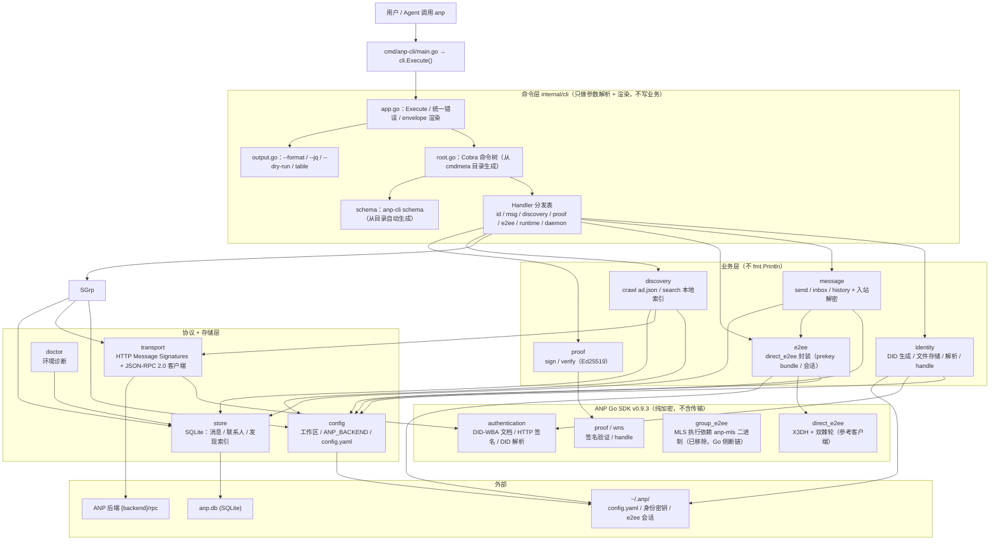
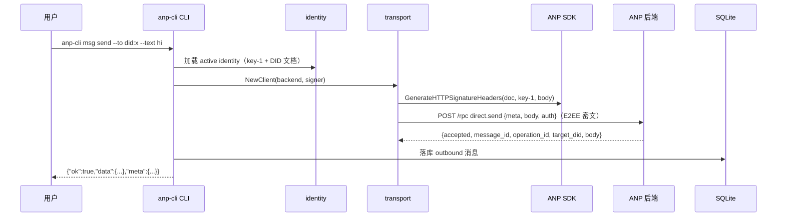
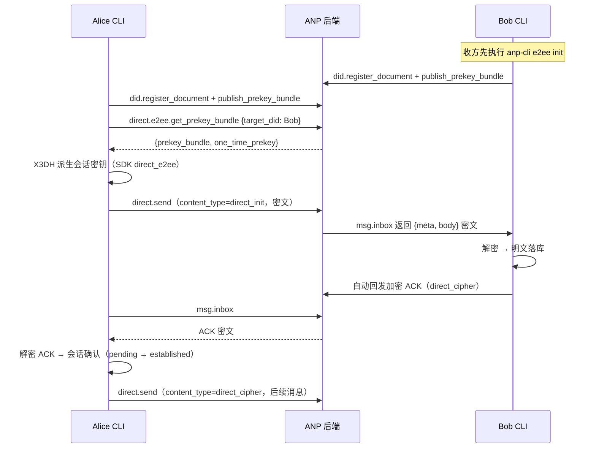
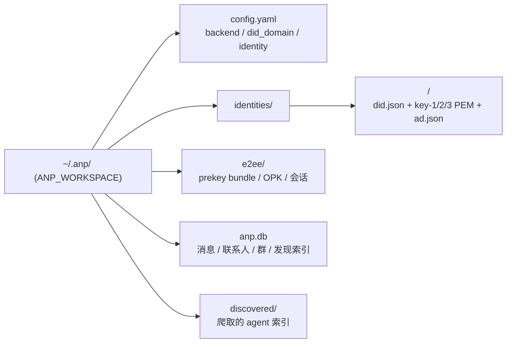

# anp-cli 架构图

> Mermaid 图。在支持 Mermaid 的查看器（GitHub、Typora、VS Code Mermaid 插件、claude.ai 等）中渲染。

## 1. 分层架构

## 2. 一条消息的完整旅程：`anp-cli msg send`（端到端加密）

## 3. E2EE 安全建链（X3DH + 自动 ACK）

## 4. 工作区布局（~/.anp/）

## 说明

- **分层原则**：命令层只负责参数 + 渲染，业务层不 `fmt.Println`，协议/存储独立，加密全部委托 ANP SDK。
- **协议**：`POST {backend}/rpc`，JSON-RPC 2.0 + HTTP Message Signatures，见 [protocol.md](protocol.md)。
- **群组**：群组 base 语义（`group.*`，transport-protected 明文）已实现；群组 E2EE（`group.e2ee.*`，MLS）server 控制面已实现，CLI 侧 MLS 计算待官方 Go SDK 更新（Go SDK 的 anp-mls 二进制被新版 Rust crate 移除、改为库调用，Go 侧无纯 Go MLS 实现）。
